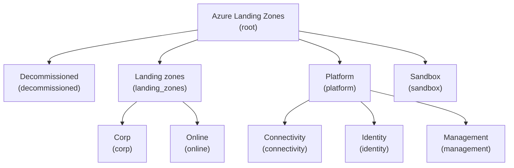

# ALZ (Azure Landing Zones)
  
This library provides the reference set of Azure Landing Zones (ALZ) policies, archetypes, and management group architecture.
  
## Usage
  
```terraform
provider "alz" {
  library_references = [
    {
      path = "platform/alz"
      tag  = "0000.00.0" # Replace with the desired version
    }
  ]
}
```
  
## Architectures
  
The following architectures are available in this library, please note that the diagrams denote the management group display name and, in brackets, the associated archetypes:
  
### architecture `alz`
  
> [!NOTE]  
> This hierarchy will be deployed as a child of the user-supplied root management group.
  

  
## Archetypes
  
### archetype `connectivity`
  
#### connectivity policy assignments
  
<details><summary>1 policy assignments</summary>

- Enable-DDoS-VNET
</details>
  
### archetype `corp`
  
#### corp policy assignments
  
<details><summary>5 policy assignments</summary>

- Audit-PeDnsZones
- Deny-HybridNetworking
- Deny-Public-Endpoints
- Deny-Public-IP-On-NIC
- Deploy-Private-DNS-Zones
</details>
  
### archetype `decommissioned`
  
#### decommissioned policy assignments
  
<details><summary>1 policy assignments</summary>

- Enforce-ALZ-Decomm
</details>
  
### archetype `identity`
  
#### identity policy assignments
  
<details><summary>4 policy assignments</summary>

- Deny-MgmtPorts-Internet
- Deny-Public-IP
- Deny-Subnet-Without-Nsg
- Deploy-VM-Backup
</details>
  
### archetype `landing_zones`
  
#### landing_zones policy assignments
  
<details><summary>25 policy assignments</summary>

- Audit-AppGW-WAF
- Deny-IP-forwarding
- Deny-MgmtPorts-Internet
- Deny-Priv-Esc-AKS
- Deny-Privileged-AKS
- Deny-Storage-http
- Deny-Subnet-Without-Nsg
- Deploy-AzSqlDb-Auditing
- Deploy-MDFC-DefSQL-AMA
- Deploy-SQL-TDE
- Deploy-SQL-Threat
- Deploy-VM-Backup
- Deploy-VM-ChangeTrack
- Deploy-VM-Monitoring
- Deploy-VMSS-ChangeTrack
- Deploy-VMSS-Monitoring
- Deploy-vmArc-ChangeTrack
- Deploy-vmHybr-Monitoring
- Enable-AUM-CheckUpdates
- Enable-DDoS-VNET
- Enforce-AKS-HTTPS
- Enforce-ASR
- Enforce-GR-KeyVault
- Enforce-Subnet-Private
- Enforce-TLS-SSL-Q225
</details>
  
### archetype `platform`
  
#### platform policy assignments
  
<details><summary>12 policy assignments</summary>

- DenyAction-DeleteUAMIAMA
- Deploy-MDFC-DefSQL-AMA
- Deploy-VM-ChangeTrack
- Deploy-VM-Monitoring
- Deploy-VMSS-ChangeTrack
- Deploy-VMSS-Monitoring
- Deploy-vmArc-ChangeTrack
- Deploy-vmHybr-Monitoring
- Enable-AUM-CheckUpdates
- Enforce-ASR
- Enforce-GR-KeyVault
- Enforce-Subnet-Private
</details>
  
### archetype `root`
  
#### root policy definitions
  
<details><summary>160 policy definitions</summary>

- Append-AppService-httpsonly
- Append-AppService-latestTLS
- Append-KV-SoftDelete
- Append-Redis-disableNonSslPort
- Append-Redis-sslEnforcement
- Audit-AzureHybridBenefit
- Audit-Disks-UnusedResourcesCostOptimization
- Audit-MachineLearning-PrivateEndpointId
- Audit-PrivateLinkDnsZones
- Audit-PublicIpAddresses-UnusedResourcesCostOptimization
- Audit-ServerFarms-UnusedResourcesCostOptimization
- Audit-Tags-Mandatory
- Audit-Tags-Mandatory-Rg
- Deny-AA-child-resources
- Deny-APIM-TLS
- Deny-AppGW-Without-WAF
- Deny-AppGw-Without-Tls
- Deny-AppService-without-BYOC
- Deny-AppServiceApiApp-http
- Deny-AppServiceFunctionApp-http
- Deny-AppServiceWebApp-http
- Deny-AzFw-Without-Policy
- Deny-CognitiveServices-NetworkAcls
- Deny-CognitiveServices-Resource-Kinds
- Deny-CognitiveServices-RestrictOutboundNetworkAccess
- Deny-Databricks-NoPublicIp
- Deny-Databricks-Sku
- Deny-Databricks-VirtualNetwork
- Deny-EH-Premium-CMK
- Deny-EH-minTLS
- Deny-FileServices-InsecureAuth
- Deny-FileServices-InsecureKerberos
- Deny-FileServices-InsecureSmbChannel
- Deny-FileServices-InsecureSmbVersions
- Deny-LogicApp-Public-Network
- Deny-LogicApps-Without-Https
- Deny-MachineLearning-Aks
- Deny-MachineLearning-Compute-SubnetId
- Deny-MachineLearning-Compute-VmSize
- Deny-MachineLearning-ComputeCluster-RemoteLoginPortPublicAccess
- Deny-MachineLearning-ComputeCluster-Scale
- Deny-MachineLearning-HbiWorkspace
- Deny-MachineLearning-PublicAccessWhenBehindVnet
- Deny-MachineLearning-PublicNetworkAccess
- Deny-MgmtPorts-From-Internet
- Deny-MySql-http
- Deny-PostgreSql-http
- Deny-Private-DNS-Zones
- Deny-PublicEndpoint-MariaDB
- Deny-PublicIP
- Deny-RDP-From-Internet
- Deny-Redis-http
- Deny-Service-Endpoints
- Deny-Sql-minTLS
- Deny-SqlMi-minTLS
- Deny-Storage-ContainerDeleteRetentionPolicy
- Deny-Storage-CopyScope
- Deny-Storage-CorsRules
- Deny-Storage-LocalUser
- Deny-Storage-NetworkAclsBypass
- Deny-Storage-NetworkAclsVirtualNetworkRules
- Deny-Storage-ResourceAccessRulesResourceId
- Deny-Storage-ResourceAccessRulesTenantId
- Deny-Storage-SFTP
- Deny-Storage-ServicesEncryption
- Deny-Storage-minTLS
- Deny-StorageAccount-CustomDomain
- Deny-Subnet-Without-Nsg
- Deny-Subnet-Without-Penp
- Deny-Subnet-Without-Udr
- Deny-UDR-With-Specific-NextHop
- Deny-VNET-Peer-Cross-Sub
- Deny-VNET-Peering-To-Non-Approved-VNETs
- Deny-VNet-Peering
- DenyAction-ActivityLogs
- DenyAction-DeleteResources
- DenyAction-DiagnosticLogs
- Deploy-ASC-SecurityContacts
- Deploy-Budget
- Deploy-Custom-Route-Table
- Deploy-DDoSProtection
- Deploy-Diagnostics-AA
- Deploy-Diagnostics-ACI
- Deploy-Diagnostics-ACR
- Deploy-Diagnostics-APIMgmt
- Deploy-Diagnostics-AVDScalingPlans
- Deploy-Diagnostics-AnalysisService
- Deploy-Diagnostics-ApiForFHIR
- Deploy-Diagnostics-ApplicationGateway
- Deploy-Diagnostics-Bastion
- Deploy-Diagnostics-CDNEndpoints
- Deploy-Diagnostics-CognitiveServices
- Deploy-Diagnostics-CosmosDB
- Deploy-Diagnostics-DLAnalytics
- Deploy-Diagnostics-DataExplorerCluster
- Deploy-Diagnostics-DataFactory
- Deploy-Diagnostics-Databricks
- Deploy-Diagnostics-EventGridSub
- Deploy-Diagnostics-EventGridSystemTopic
- Deploy-Diagnostics-EventGridTopic
- Deploy-Diagnostics-ExpressRoute
- Deploy-Diagnostics-Firewall
- Deploy-Diagnostics-FrontDoor
- Deploy-Diagnostics-Function
- Deploy-Diagnostics-HDInsight
- Deploy-Diagnostics-LoadBalancer
- Deploy-Diagnostics-LogAnalytics
- Deploy-Diagnostics-LogicAppsISE
- Deploy-Diagnostics-MariaDB
- Deploy-Diagnostics-MediaService
- Deploy-Diagnostics-MlWorkspace
- Deploy-Diagnostics-MySQL
- Deploy-Diagnostics-NIC
- Deploy-Diagnostics-NetworkSecurityGroups
- Deploy-Diagnostics-PostgreSQL
- Deploy-Diagnostics-PowerBIEmbedded
- Deploy-Diagnostics-RedisCache
- Deploy-Diagnostics-Relay
- Deploy-Diagnostics-SQLElasticPools
- Deploy-Diagnostics-SQLMI
- Deploy-Diagnostics-SignalR
- Deploy-Diagnostics-TimeSeriesInsights
- Deploy-Diagnostics-TrafficManager
- Deploy-Diagnostics-VM
- Deploy-Diagnostics-VMSS
- Deploy-Diagnostics-VNetGW
- Deploy-Diagnostics-VWanS2SVPNGW
- Deploy-Diagnostics-VirtualNetwork
- Deploy-Diagnostics-WVDAppGroup
- Deploy-Diagnostics-WVDHostPools
- Deploy-Diagnostics-WVDWorkspace
- Deploy-Diagnostics-WebServerFarm
- Deploy-Diagnostics-Website
- Deploy-Diagnostics-iotHub
- Deploy-FirewallPolicy
- Deploy-LogicApp-TLS
- Deploy-MDFC-Arc-SQL-DCR-Association
- Deploy-MDFC-Arc-Sql-DefenderSQL-DCR
- Deploy-MDFC-SQL-AMA
- Deploy-MDFC-SQL-DefenderSQL
- Deploy-MDFC-SQL-DefenderSQL-DCR
- Deploy-MySQL-sslEnforcement
- Deploy-Nsg-FlowLogs
- Deploy-Nsg-FlowLogs-to-LA
- Deploy-PostgreSQL-sslEnforcement
- Deploy-Private-DNS-Generic
- Deploy-SQL-minTLS
- Deploy-Sql-AuditingSettings
- Deploy-Sql-SecurityAlertPolicies
- Deploy-Sql-Tde
- Deploy-Sql-vulnerabilityAssessments
- Deploy-Sql-vulnerabilityAssessments_20230706
- Deploy-SqlMi-minTLS
- Deploy-Storage-sslEnforcement
- Deploy-UserAssignedManagedIdentity-VMInsights
- Deploy-VNET-HubSpoke
- Deploy-Vm-autoShutdown
- Deploy-Windows-DomainJoin
- Modify-NSG
- Modify-UDR
</details>
  
#### root policy set definitions
  
<details><summary>47 policy set definitions</summary>

- Audit-TrustedLaunch
- Audit-UnusedResourcesCostOptimization
- Deny-PublicPaaSEndpoints
- DenyAction-DeleteProtection
- Deploy-AUM-CheckUpdates
- Deploy-Diagnostics-LogAnalytics
- Deploy-MDFC-Config
- Deploy-MDFC-Config_20240319
- Deploy-MDFC-DefenderSQL-AMA
- Deploy-Private-DNS-Zones
- Deploy-Sql-Security
- Deploy-Sql-Security_20240529
- Enforce-ACSB
- Enforce-ALZ-Decomm
- Enforce-ALZ-Sandbox
- Enforce-Backup
- Enforce-EncryptTransit
- Enforce-EncryptTransit_20240509
- Enforce-EncryptTransit_20241211
- Enforce-Encryption-CMK_20250218
- Enforce-Guardrails-APIM
- Enforce-Guardrails-AppServices
- Enforce-Guardrails-Automation
- Enforce-Guardrails-BotService
- Enforce-Guardrails-CognitiveServices
- Enforce-Guardrails-Compute
- Enforce-Guardrails-ContainerApps
- Enforce-Guardrails-ContainerInstance
- Enforce-Guardrails-ContainerRegistry
- Enforce-Guardrails-CosmosDb
- Enforce-Guardrails-DataExplorer
- Enforce-Guardrails-DataFactory
- Enforce-Guardrails-EventGrid
- Enforce-Guardrails-EventHub
- Enforce-Guardrails-KeyVault
- Enforce-Guardrails-KeyVault-Sup
- Enforce-Guardrails-Kubernetes
- Enforce-Guardrails-MachineLearning
- Enforce-Guardrails-MySQL
- Enforce-Guardrails-Network
- Enforce-Guardrails-OpenAI
- Enforce-Guardrails-PostgreSQL
- Enforce-Guardrails-SQL
- Enforce-Guardrails-ServiceBus
- Enforce-Guardrails-Storage
- Enforce-Guardrails-Synapse
- Enforce-Guardrails-VirtualDesktop
</details>
  
#### root policy assignments
  
<details><summary>15 policy assignments</summary>

- Audit-ResourceRGLocation
- Audit-TrustedLaunch
- Audit-UnusedResources
- Audit-ZoneResiliency
- Deny-Classic-Resources
- Deny-UnmanagedDisk
- Deploy-ASC-Monitoring
- Deploy-AzActivity-Log
- Deploy-Diag-LogsCat
- Deploy-MDEndpoints
- Deploy-MDEndpointsAMA
- Deploy-MDFC-Config-H224
- Deploy-MDFC-OssDb
- Deploy-MDFC-SqlAtp
- Enforce-ACSB
</details>
  
#### root role definitions
  
<details><summary>5 role definitions</summary>

- Application-Owners
- Network-Management
- Network-Subnet-Contributor
- Security-Operations
- Subscription-Owner
</details>
  
### archetype `sandbox`
  
#### sandbox policy assignments
  
<details><summary>1 policy assignments</summary>

- Enforce-ALZ-Sandbox
</details>
  
## Policy Default Values
  
The following policy default values are available in this library:
  
### default name `ama_change_tracking_data_collection_rule_id`
  
The data collection rule id that should be used for the change tracking deployment.
  
|        ASSIGNMENT        | PARAMETER NAMES |
|--------------------------|-----------------|
| Deploy-VM-ChangeTrack    | dcrResourceId   |
| Deploy-VMSS-ChangeTrack  | dcrResourceId   |
| Deploy-vmArc-ChangeTrack | dcrResourceId   |

  
### default name `ama_mdfc_sql_data_collection_rule_id`
  
The data collection rule id that should be used for the SQL MDFC deployment.
  
|       ASSIGNMENT       | PARAMETER NAMES |
|------------------------|-----------------|
| Deploy-MDFC-DefSQL-AMA | dcrResourceId   |

  
### default name `ama_user_assigned_managed_identity_id`
  
The user assigned managed identity id that should be used for the AMA deployment.
  
|       ASSIGNMENT        |        PARAMETER NAMES         |
|-------------------------|--------------------------------|
| Deploy-MDFC-DefSQL-AMA  | userAssignedIdentityResourceId |
| Deploy-VM-ChangeTrack   | userAssignedIdentityResourceId |
| Deploy-VM-Monitoring    | userAssignedIdentityResourceId |
| Deploy-VMSS-ChangeTrack | userAssignedIdentityResourceId |
| Deploy-VMSS-Monitoring  | userAssignedIdentityResourceId |

  
### default name `ama_user_assigned_managed_identity_name`
  
The user assigned managed identity name that is used for the deny action policy to prevent the accidental deletion of the AMA identity.
  
|        ASSIGNMENT        | PARAMETER NAMES |
|--------------------------|-----------------|
| DenyAction-DeleteUAMIAMA | resourceName    |

  
### default name `ama_vm_insights_data_collection_rule_id`
  
The data collection rule id that should be used for the VM Insights deployment.
  
|        ASSIGNMENT        | PARAMETER NAMES |
|--------------------------|-----------------|
| Deploy-VM-Monitoring     | dcrResourceId   |
| Deploy-VMSS-Monitoring   | dcrResourceId   |
| Deploy-vmHybr-Monitoring | dcrResourceId   |

  
### default name `ddos_protection_plan_id`
  
The DDoS protection plan id that should be used for the DDoS protection plan deployment. If this is invalid or you do not use DDoS protection, make sure to change the enforcement mode of the Enable-DDoS-VNET policy to 'DoNotEnforce'.
  
|    ASSIGNMENT    | PARAMETER NAMES |
|------------------|-----------------|
| Enable-DDoS-VNET | ddosPlan        |

  
### default name `log_analytics_workspace_id`
  
The Log Analytics workspace id that should be used for centralized log collection.
  
|       ASSIGNMENT        |     PARAMETER NAMES     |
|-------------------------|-------------------------|
| Deploy-AzActivity-Log   | logAnalytics            |
| Deploy-AzSqlDb-Auditing | logAnalyticsWorkspaceId |
| Deploy-Diag-LogsCat     | logAnalytics            |
| Deploy-MDFC-Config-H224 | logAnalytics            |
| Deploy-MDFC-DefSQL-AMA  | userWorkspaceResourceId |

  
### default name `private_dns_zone_region`
  
The region short name (e.g. `westus`) that should be used for the region specific private link DNS zones.
  
|        ASSIGNMENT        | PARAMETER NAMES |
|--------------------------|-----------------|
| Deploy-Private-DNS-Zones | dnsZoneRegion   |

  
### default name `private_dns_zone_resource_group_name`
  
The resource group name that hosts the private link DNS zones.
  
|        ASSIGNMENT        |     PARAMETER NAMES      |
|--------------------------|--------------------------|
| Deploy-Private-DNS-Zones | dnsZoneResourceGroupName |

  
### default name `private_dns_zone_subscription_id`
  
The subscription id that hosts the private link DNS zones.
  
|        ASSIGNMENT        |    PARAMETER NAMES    |
|--------------------------|-----------------------|
| Deploy-Private-DNS-Zones | dnsZoneSubscriptionId |

  
---
## Contents
  
### all policy definitions
  
<details><summary>160 policy definitions</summary>

- Append-AppService-httpsonly
- Append-AppService-latestTLS
- Append-KV-SoftDelete
- Append-Redis-disableNonSslPort
- Append-Redis-sslEnforcement
- Audit-AzureHybridBenefit
- Audit-Disks-UnusedResourcesCostOptimization
- Audit-MachineLearning-PrivateEndpointId
- Audit-PrivateLinkDnsZones
- Audit-PublicIpAddresses-UnusedResourcesCostOptimization
- Audit-ServerFarms-UnusedResourcesCostOptimization
- Audit-Tags-Mandatory
- Audit-Tags-Mandatory-Rg
- Deny-AA-child-resources
- Deny-APIM-TLS
- Deny-AppGW-Without-WAF
- Deny-AppGw-Without-Tls
- Deny-AppService-without-BYOC
- Deny-AppServiceApiApp-http
- Deny-AppServiceFunctionApp-http
- Deny-AppServiceWebApp-http
- Deny-AzFw-Without-Policy
- Deny-CognitiveServices-NetworkAcls
- Deny-CognitiveServices-Resource-Kinds
- Deny-CognitiveServices-RestrictOutboundNetworkAccess
- Deny-Databricks-NoPublicIp
- Deny-Databricks-Sku
- Deny-Databricks-VirtualNetwork
- Deny-EH-Premium-CMK
- Deny-EH-minTLS
- Deny-FileServices-InsecureAuth
- Deny-FileServices-InsecureKerberos
- Deny-FileServices-InsecureSmbChannel
- Deny-FileServices-InsecureSmbVersions
- Deny-LogicApp-Public-Network
- Deny-LogicApps-Without-Https
- Deny-MachineLearning-Aks
- Deny-MachineLearning-Compute-SubnetId
- Deny-MachineLearning-Compute-VmSize
- Deny-MachineLearning-ComputeCluster-RemoteLoginPortPublicAccess
- Deny-MachineLearning-ComputeCluster-Scale
- Deny-MachineLearning-HbiWorkspace
- Deny-MachineLearning-PublicAccessWhenBehindVnet
- Deny-MachineLearning-PublicNetworkAccess
- Deny-MgmtPorts-From-Internet
- Deny-MySql-http
- Deny-PostgreSql-http
- Deny-Private-DNS-Zones
- Deny-PublicEndpoint-MariaDB
- Deny-PublicIP
- Deny-RDP-From-Internet
- Deny-Redis-http
- Deny-Service-Endpoints
- Deny-Sql-minTLS
- Deny-SqlMi-minTLS
- Deny-Storage-ContainerDeleteRetentionPolicy
- Deny-Storage-CopyScope
- Deny-Storage-CorsRules
- Deny-Storage-LocalUser
- Deny-Storage-NetworkAclsBypass
- Deny-Storage-NetworkAclsVirtualNetworkRules
- Deny-Storage-ResourceAccessRulesResourceId
- Deny-Storage-ResourceAccessRulesTenantId
- Deny-Storage-SFTP
- Deny-Storage-ServicesEncryption
- Deny-Storage-minTLS
- Deny-StorageAccount-CustomDomain
- Deny-Subnet-Without-Nsg
- Deny-Subnet-Without-Penp
- Deny-Subnet-Without-Udr
- Deny-UDR-With-Specific-NextHop
- Deny-VNET-Peer-Cross-Sub
- Deny-VNET-Peering-To-Non-Approved-VNETs
- Deny-VNet-Peering
- DenyAction-ActivityLogs
- DenyAction-DeleteResources
- DenyAction-DiagnosticLogs
- Deploy-ASC-SecurityContacts
- Deploy-Budget
- Deploy-Custom-Route-Table
- Deploy-DDoSProtection
- Deploy-Diagnostics-AA
- Deploy-Diagnostics-ACI
- Deploy-Diagnostics-ACR
- Deploy-Diagnostics-APIMgmt
- Deploy-Diagnostics-AVDScalingPlans
- Deploy-Diagnostics-AnalysisService
- Deploy-Diagnostics-ApiForFHIR
- Deploy-Diagnostics-ApplicationGateway
- Deploy-Diagnostics-Bastion
- Deploy-Diagnostics-CDNEndpoints
- Deploy-Diagnostics-CognitiveServices
- Deploy-Diagnostics-CosmosDB
- Deploy-Diagnostics-DLAnalytics
- Deploy-Diagnostics-DataExplorerCluster
- Deploy-Diagnostics-DataFactory
- Deploy-Diagnostics-Databricks
- Deploy-Diagnostics-EventGridSub
- Deploy-Diagnostics-EventGridSystemTopic
- Deploy-Diagnostics-EventGridTopic
- Deploy-Diagnostics-ExpressRoute
- Deploy-Diagnostics-Firewall
- Deploy-Diagnostics-FrontDoor
- Deploy-Diagnostics-Function
- Deploy-Diagnostics-HDInsight
- Deploy-Diagnostics-LoadBalancer
- Deploy-Diagnostics-LogAnalytics
- Deploy-Diagnostics-LogicAppsISE
- Deploy-Diagnostics-MariaDB
- Deploy-Diagnostics-MediaService
- Deploy-Diagnostics-MlWorkspace
- Deploy-Diagnostics-MySQL
- Deploy-Diagnostics-NIC
- Deploy-Diagnostics-NetworkSecurityGroups
- Deploy-Diagnostics-PostgreSQL
- Deploy-Diagnostics-PowerBIEmbedded
- Deploy-Diagnostics-RedisCache
- Deploy-Diagnostics-Relay
- Deploy-Diagnostics-SQLElasticPools
- Deploy-Diagnostics-SQLMI
- Deploy-Diagnostics-SignalR
- Deploy-Diagnostics-TimeSeriesInsights
- Deploy-Diagnostics-TrafficManager
- Deploy-Diagnostics-VM
- Deploy-Diagnostics-VMSS
- Deploy-Diagnostics-VNetGW
- Deploy-Diagnostics-VWanS2SVPNGW
- Deploy-Diagnostics-VirtualNetwork
- Deploy-Diagnostics-WVDAppGroup
- Deploy-Diagnostics-WVDHostPools
- Deploy-Diagnostics-WVDWorkspace
- Deploy-Diagnostics-WebServerFarm
- Deploy-Diagnostics-Website
- Deploy-Diagnostics-iotHub
- Deploy-FirewallPolicy
- Deploy-LogicApp-TLS
- Deploy-MDFC-Arc-SQL-DCR-Association
- Deploy-MDFC-Arc-Sql-DefenderSQL-DCR
- Deploy-MDFC-SQL-AMA
- Deploy-MDFC-SQL-DefenderSQL
- Deploy-MDFC-SQL-DefenderSQL-DCR
- Deploy-MySQL-sslEnforcement
- Deploy-Nsg-FlowLogs
- Deploy-Nsg-FlowLogs-to-LA
- Deploy-PostgreSQL-sslEnforcement
- Deploy-Private-DNS-Generic
- Deploy-SQL-minTLS
- Deploy-Sql-AuditingSettings
- Deploy-Sql-SecurityAlertPolicies
- Deploy-Sql-Tde
- Deploy-Sql-vulnerabilityAssessments
- Deploy-Sql-vulnerabilityAssessments_20230706
- Deploy-SqlMi-minTLS
- Deploy-Storage-sslEnforcement
- Deploy-UserAssignedManagedIdentity-VMInsights
- Deploy-VNET-HubSpoke
- Deploy-Vm-autoShutdown
- Deploy-Windows-DomainJoin
- Modify-NSG
- Modify-UDR
</details>
  
### all policy set definitions
  
<details><summary>47 policy set definitions</summary>

- Audit-TrustedLaunch
- Audit-UnusedResourcesCostOptimization
- Deny-PublicPaaSEndpoints
- DenyAction-DeleteProtection
- Deploy-AUM-CheckUpdates
- Deploy-Diagnostics-LogAnalytics
- Deploy-MDFC-Config
- Deploy-MDFC-Config_20240319
- Deploy-MDFC-DefenderSQL-AMA
- Deploy-Private-DNS-Zones
- Deploy-Sql-Security
- Deploy-Sql-Security_20240529
- Enforce-ACSB
- Enforce-ALZ-Decomm
- Enforce-ALZ-Sandbox
- Enforce-Backup
- Enforce-EncryptTransit
- Enforce-EncryptTransit_20240509
- Enforce-EncryptTransit_20241211
- Enforce-Encryption-CMK_20250218
- Enforce-Guardrails-APIM
- Enforce-Guardrails-AppServices
- Enforce-Guardrails-Automation
- Enforce-Guardrails-BotService
- Enforce-Guardrails-CognitiveServices
- Enforce-Guardrails-Compute
- Enforce-Guardrails-ContainerApps
- Enforce-Guardrails-ContainerInstance
- Enforce-Guardrails-ContainerRegistry
- Enforce-Guardrails-CosmosDb
- Enforce-Guardrails-DataExplorer
- Enforce-Guardrails-DataFactory
- Enforce-Guardrails-EventGrid
- Enforce-Guardrails-EventHub
- Enforce-Guardrails-KeyVault
- Enforce-Guardrails-KeyVault-Sup
- Enforce-Guardrails-Kubernetes
- Enforce-Guardrails-MachineLearning
- Enforce-Guardrails-MySQL
- Enforce-Guardrails-Network
- Enforce-Guardrails-OpenAI
- Enforce-Guardrails-PostgreSQL
- Enforce-Guardrails-SQL
- Enforce-Guardrails-ServiceBus
- Enforce-Guardrails-Storage
- Enforce-Guardrails-Synapse
- Enforce-Guardrails-VirtualDesktop
</details>
  
### all policy assignments
  
<details><summary>50 policy assignments</summary>

- Audit-AppGW-WAF
- Audit-PeDnsZones
- Audit-ResourceRGLocation
- Audit-TrustedLaunch
- Audit-UnusedResources
- Audit-ZoneResiliency
- Deny-Classic-Resources
- Deny-HybridNetworking
- Deny-IP-forwarding
- Deny-MgmtPorts-Internet
- Deny-Priv-Esc-AKS
- Deny-Privileged-AKS
- Deny-Public-Endpoints
- Deny-Public-IP
- Deny-Public-IP-On-NIC
- Deny-Storage-http
- Deny-Subnet-Without-Nsg
- Deny-UnmanagedDisk
- DenyAction-DeleteUAMIAMA
- Deploy-ASC-Monitoring
- Deploy-AzActivity-Log
- Deploy-AzSqlDb-Auditing
- Deploy-Diag-LogsCat
- Deploy-MDEndpoints
- Deploy-MDEndpointsAMA
- Deploy-MDFC-Config-H224
- Deploy-MDFC-DefSQL-AMA
- Deploy-MDFC-OssDb
- Deploy-MDFC-SqlAtp
- Deploy-Private-DNS-Zones
- Deploy-SQL-TDE
- Deploy-SQL-Threat
- Deploy-VM-Backup
- Deploy-VM-ChangeTrack
- Deploy-VM-Monitoring
- Deploy-VMSS-ChangeTrack
- Deploy-VMSS-Monitoring
- Deploy-vmArc-ChangeTrack
- Deploy-vmHybr-Monitoring
- Enable-AUM-CheckUpdates
- Enable-DDoS-VNET
- Enforce-ACSB
- Enforce-AKS-HTTPS
- Enforce-ALZ-Decomm
- Enforce-ALZ-Sandbox
- Enforce-ASR
- Enforce-GR-KeyVault
- Enforce-Subnet-Private
- Enforce-TLS-SSL-H224
- Enforce-TLS-SSL-Q225
</details>
  
### all role definitions
  
<details><summary>5 role definitions</summary>

- Application-Owners
- Network-Management
- Network-Subnet-Contributor
- Security-Operations
- Subscription-Owner
</details>
  