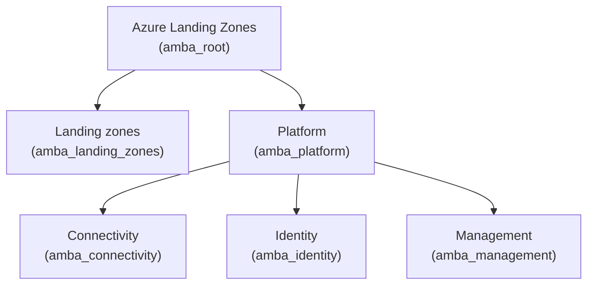

# AMBA (Azure Monitor Baseline Alerts for Azure Landing Zones)
  
This library provides the reference set of Azure Monitor Baseline Alerts for Azure Landing Zones (ALZ) policies, archetypes, and management group architecture.
  
## Usage
  
```terraform
provider "alz" {
  library_references = [
    {
      path = "platform/amba"
      tag  = "0000.00.0" # Replace with the desired version
    }
  ]
}
```
  
## Architectures
  
The following architectures are available in this library, please note that the diagrams denote the management group display name and, in brackets, the associated archetypes:
  
### architecture `amba`
  
> [!NOTE]  
> This hierarchy will be deployed as a child of the user-supplied root management group.
  

  
## Archetypes
  
### archetype `amba_connectivity`
  
#### amba_connectivity policy assignments
  
<details><summary>2 policy assignments</summary>

- Deploy-AMBA-Connectivity
- Deploy-AMBAConnectivity2
</details>
  
### archetype `amba_identity`
  
#### amba_identity policy assignments
  
<details><summary>1 policy assignments</summary>

- Deploy-AMBA-Identity
</details>
  
### archetype `amba_landing_zones`
  
#### amba_landing_zones policy assignments
  
<details><summary>8 policy assignments</summary>

- Deploy-AMBA-HybridVM
- Deploy-AMBA-KeyMgmt
- Deploy-AMBA-LoadBalance
- Deploy-AMBA-NetworkChang
- Deploy-AMBA-RecoverySvc
- Deploy-AMBA-Storage
- Deploy-AMBA-VM
- Deploy-AMBA-Web
</details>
  
### archetype `amba_management`
  
#### amba_management policy assignments
  
<details><summary>1 policy assignments</summary>

- Deploy-AMBA-Management
</details>
  
### archetype `amba_platform`
  
#### amba_platform policy assignments
  
<details><summary>2 policy assignments</summary>

- Deploy-AMBA-HybridVM
- Deploy-AMBA-VM
</details>
  
### archetype `amba_root`
  
#### amba_root policy definitions
  
<details><summary>132 policy definitions</summary>

- Deploy-P2SVPNGateways-P2SBandwidth-Alert
- Deploy-P2SVPNGateways-P2SConnectionCount-Alert
- Deploy-P2SVPNGateways-UserVpnRouteCount-Alert
- Deploy-VirtualHubs-BgpPeerStatus-Alert
- Deploy-VirtualHubs-CountOfRoutesAdvertisedToPeer-Alert
- Deploy-VirtualHubs-CountOfRoutesLearnedFromPeer-Alert
- Deploy-VirtualHubs-RoutingInfrastructureUnits-Alert
- Deploy-VirtualHubs-SpokeVMUtilization-Alert
- Deploy-VirtualHubs-VirtualHubDataProcessed-Alert
- Deploy_AA_TotalJob_Alert
- Deploy_AFW_ApplicationRuleHit_Alert
- Deploy_AFW_FirewallHealth_Alert
- Deploy_AFW_NetworkRuleHit_Alert
- Deploy_AFW_SNATPortUtilization_Alert
- Deploy_AG_ApplicationGatewayTotalTime_Alert
- Deploy_AG_BackendLastByteResponseTime_Alert
- Deploy_AG_CPUUtilization_Alert
- Deploy_AG_CapacityUnits_Alert
- Deploy_AG_ComputeUnits_Alert
- Deploy_AG_FailedRequests_Alert
- Deploy_AG_ResponseStatus_Alert
- Deploy_AG_UnhealthyHostCount_Alert
- Deploy_ALB_DataPathAvailability_Alert
- Deploy_ALB_GlobalBackendAvailability_Alert
- Deploy_ALB_HealthProbeStatus_Alert
- Deploy_ALB_UsedSNATPorts_Alert
- Deploy_ActivityLog_AppInsights_Delete
- Deploy_ActivityLog_ManagedHSMs_Delete
- Deploy_AlertProcessing_Rule
- Deploy_AppInsightsThrottlingLimit_Alert
- Deploy_DNSZ_RegistrationCapacityUtil_Alert
- Deploy_ERCIR_ArpAvailability_Alert
- Deploy_ERCIR_BgpAvailability_Alert
- Deploy_ERCIR_QosDropBitsInPerSecond_Alert
- Deploy_ERCIR_QosDropBitsOutPerSecond_Alert
- Deploy_ERGw_ExpressRouteBitsIn_Alert
- Deploy_ERGw_ExpressRouteBitsOut_Alert
- Deploy_ERGw_ExpressRouteCpuUtil_Alert
- Deploy_ERGw_ExpressRouteGatewayActiveFlows_Alert
- Deploy_ERP_ExpressRoutLineProtocol_Alert
- Deploy_ERP_ExpressRoutRxLightLevel_Alert
- Deploy_ERP_ExpressRoutRxLightLevellow_Alert
- Deploy_ERP_ExpressRoutTxLightLevell_Alert
- Deploy_ERP_ExpressRoutTxLightLevellow_Alert
- Deploy_ERP_ExpressRouteBitsIn_Alert
- Deploy_ERP_ExpressRouteBitsOut_Alert
- Deploy_FD_BackendHealth_Alert
- Deploy_FD_BackendRequestLatency_Alert
- Deploy_FrontDoorCDN_OriginHealthPercentage_Alert
- Deploy_FrontDoorCDN_OriginLatency_Alert
- Deploy_FrontDoorCDN_Percentage4XX_Alert
- Deploy_FrontDoorCDN_Percentage5XX_Alert
- Deploy_Hybrid_VM_CPU_Alert
- Deploy_Hybrid_VM_Disconnected_Alert
- Deploy_Hybrid_VM_HeartBeat_Alert
- Deploy_Hybrid_VM_Memory_Alert
- Deploy_Hybrid_VM_NetworkIn_Alert
- Deploy_Hybrid_VM_NetworkOut_Alert
- Deploy_Hybrid_VM_OSDiskSpace_Alert
- Deploy_Hybrid_VM_OSDiskreadLatency_Alert
- Deploy_Hybrid_VM_OSDiskwriteLatency_Alert
- Deploy_Hybrid_VM_dataDiskReadLatency_Alert
- Deploy_Hybrid_VM_dataDiskSpace_Alert
- Deploy_Hybrid_VM_dataDiskWriteLatency_Alert
- Deploy_KeyVault_Availability_Alert
- Deploy_KeyVault_Capacity_Alert
- Deploy_KeyVault_Latency_Alert
- Deploy_KeyVault_Requests_Alert
- Deploy_LAWorkspace_DailyCapLimitReached_Alert
- Deploy_ManagedHSMs_Availability_Alert
- Deploy_ManagedHSMs_Latency_Alert
- Deploy_PDNSZ_CapacityUtil_Alert
- Deploy_PDNSZ_QueryVolume_Alert
- Deploy_PDNSZ_RecordSetCapacity_Alert
- Deploy_PublicIp_BytesInDDoSAttack_Alert
- Deploy_PublicIp_DDoSAttack_Alert
- Deploy_PublicIp_PacketsInDDoSAttack_Alert
- Deploy_PublicIp_VIPAvailability_Alert
- Deploy_RecoveryVault_ASRHealthMonitor_Alert
- Deploy_RecoveryVault_BackupHealthMonitor_Alert
- Deploy_ServiceHealth_ActionGroups
- Deploy_StorageAccount_Availability_Alert
- Deploy_Suppression_AlertProcessing_Rule
- Deploy_TM_EndpointHealth_Alert
- Deploy_VM_CPU_Alert
- Deploy_VM_HeartBeat_Alert
- Deploy_VM_Memory_Alert
- Deploy_VM_NetworkIn_Alert
- Deploy_VM_NetworkOut_Alert
- Deploy_VM_OSDiskSpace_Alert
- Deploy_VM_OSDiskreadLatency_Alert
- Deploy_VM_OSDiskwriteLatency_Alert
- Deploy_VM_dataDiskReadLatency_Alert
- Deploy_VM_dataDiskSpace_Alert
- Deploy_VM_dataDiskWriteLatency_Alert
- Deploy_VNET_DDoSAttack_Alert
- Deploy_VPNGw_BGPPeerStatus_Alert
- Deploy_VPNGw_BandwidthUtil_Alert
- Deploy_VPNGw_Egress_Alert
- Deploy_VPNGw_Ingress_Alert
- Deploy_VPNGw_TunnelEgressPacketDropCount_Alert
- Deploy_VPNGw_TunnelEgressPacketDropMismatch_Alert
- Deploy_VPNGw_TunnelIngressPacketDropCount_Alert
- Deploy_VPNGw_TunnelIngressPacketDropMismatch_Alert
- Deploy_VnetGw_ExpressRouteBitsPerSecond_Alert
- Deploy_VnetGw_ExpressRouteCpuUtil_Alert
- Deploy_VnetGw_TunnelBandwidth_Alert
- Deploy_VnetGw_TunnelEgressPacketDropCount_Alert
- Deploy_VnetGw_TunnelEgressPacketDropMismatch_Alert
- Deploy_VnetGw_TunnelEgress_Alert
- Deploy_VnetGw_TunnelIngressPacketDropCount_Alert
- Deploy_VnetGw_TunnelIngressPacketDropMismatch_Alert
- Deploy_VnetGw_TunnelIngress_Alert
- Deploy_WSF_CPUPercentage_Alert
- Deploy_WSF_DiskQueueLength_Alert
- Deploy_WSF_HttpQueueLength_Alert
- Deploy_WSF_MemoryPercentage_Alert
- Deploy_activitylog_Firewall_Delete
- Deploy_activitylog_KeyVault_Delete
- Deploy_activitylog_LAWorkspace_Delete
- Deploy_activitylog_LAWorkspace_KeyRegen
- Deploy_activitylog_NSG_Delete
- Deploy_activitylog_ResourceHealth_Unhealthy_Alert
- Deploy_activitylog_RouteTable_Delete
- Deploy_activitylog_RouteTable_Routes_Delete
- Deploy_activitylog_RouteTable_Update
- Deploy_activitylog_ServiceHealth_HealthAdvisory
- Deploy_activitylog_ServiceHealth_Incident
- Deploy_activitylog_ServiceHealth_Maintenance
- Deploy_activitylog_ServiceHealth_SecurityAdvisory
- Deploy_activitylog_StorageAccount_Delete
- Deploy_activitylog_VPNGateway_Delete
</details>
  
#### amba_root policy set definitions
  
<details><summary>14 policy set definitions</summary>

- Alerting-Connectivity
- Alerting-Connectivity-2
- Alerting-HybridVM
- Alerting-Identity
- Alerting-KeyManagement
- Alerting-LoadBalancing
- Alerting-Management
- Alerting-NetworkChanges
- Alerting-RecoveryServices
- Alerting-ServiceHealth
- Alerting-Storage
- Alerting-VM
- Alerting-Web
- Notification-Assets
</details>
  
#### amba_root policy assignments
  
<details><summary>2 policy assignments</summary>

- Deploy-AMBA-Notification
- Deploy-AMBA-SvcHealth
</details>
  
## Policy Default Values
  
The following policy default values are available in this library:
  
### default name `amba_alz_action_group_email`
  
The email address(es) in the action group for alert notifications.
  
|        ASSIGNMENT        |      PARAMETER NAMES       |
|--------------------------|----------------------------|
| Deploy-AMBA-Notification | ALZMonitorActionGroupEmail |
| Deploy-AMBA-SvcHealth    | ALZMonitorActionGroupEmail |

  
### default name `amba_alz_arm_role_id`
  
The ARM role id(s) in the action group for alert notifications.
  
|        ASSIGNMENT        | PARAMETER NAMES |
|--------------------------|-----------------|
| Deploy-AMBA-Notification | ALZArmRoleId    |
| Deploy-AMBA-SvcHealth    | ALZArmRoleId    |

  
### default name `amba_alz_byo_action_group`
  
The resource id of the action group, required if you intend to use an existing action group for monitoring purposes.
  
|        ASSIGNMENT        | PARAMETER NAMES |
|--------------------------|-----------------|
| Deploy-AMBA-Notification | BYOActionGroup  |
| Deploy-AMBA-SvcHealth    | BYOActionGroup  |

  
### default name `amba_alz_byo_alert_processing_rule`
  
The resource id of the alert processing rule, required if you intend to use an existing alert processing rule for monitoring purposes.
  
|        ASSIGNMENT        |    PARAMETER NAMES     |
|--------------------------|------------------------|
| Deploy-AMBA-Notification | BYOAlertProcessingRule |
| Deploy-AMBA-SvcHealth    | BYOAlertProcessingRule |

  
### default name `amba_alz_byo_user_assigned_managed_identity_id`
  
The resource id of the user assigned managed identity, required if you intend to use an existing user assigned managed identity for monitoring purposes.
  
|       ASSIGNMENT       |             PARAMETER NAMES              |
|------------------------|------------------------------------------|
| Deploy-AMBA-HybridVM   | BYOUserAssignedManagedIdentityResourceId |
| Deploy-AMBA-Management | BYOUserAssignedManagedIdentityResourceId |
| Deploy-AMBA-VM         | BYOUserAssignedManagedIdentityResourceId |
| Deploy-AMBA-Web        | BYOUserAssignedManagedIdentityResourceId |

  
### default name `amba_alz_disable_tag_name`
  
Tag name used to disable monitoring at the resource level.
  
|        ASSIGNMENT        |     PARAMETER NAMES      |
|--------------------------|--------------------------|
| Deploy-AMBA-Connectivity | ALZMonitorDisableTagName |
| Deploy-AMBA-HybridVM     | ALZMonitorDisableTagName |
| Deploy-AMBA-Identity     | ALZMonitorDisableTagName |
| Deploy-AMBA-KeyMgmt      | ALZMonitorDisableTagName |
| Deploy-AMBA-Management   | ALZMonitorDisableTagName |
| Deploy-AMBA-NetworkChang | ALZMonitorDisableTagName |
| Deploy-AMBA-Notification | ALZMonitorDisableTagName |
| Deploy-AMBA-Storage      | ALZMonitorDisableTagName |
| Deploy-AMBA-SvcHealth    | ALZMonitorDisableTagName |
| Deploy-AMBA-VM           | ALZMonitorDisableTagName |
| Deploy-AMBA-Web          | ALZMonitorDisableTagName |
| Deploy-AMBAConnectivity2 | ALZMonitorDisableTagName |

  
### default name `amba_alz_disable_tag_values`
  
Tag value(s) used to disable monitoring at the resource level.
  
|        ASSIGNMENT        |      PARAMETER NAMES       |
|--------------------------|----------------------------|
| Deploy-AMBA-Connectivity | ALZMonitorDisableTagValues |
| Deploy-AMBA-HybridVM     | ALZMonitorDisableTagValues |
| Deploy-AMBA-Identity     | ALZMonitorDisableTagValues |
| Deploy-AMBA-KeyMgmt      | ALZMonitorDisableTagValues |
| Deploy-AMBA-Management   | ALZMonitorDisableTagValues |
| Deploy-AMBA-NetworkChang | ALZMonitorDisableTagValues |
| Deploy-AMBA-Notification | ALZMonitorDisableTagValues |
| Deploy-AMBA-Storage      | ALZMonitorDisableTagValues |
| Deploy-AMBA-SvcHealth    | ALZMonitorDisableTagValues |
| Deploy-AMBA-VM           | ALZMonitorDisableTagValues |
| Deploy-AMBA-Web          | ALZMonitorDisableTagValues |
| Deploy-AMBAConnectivity2 | ALZMonitorDisableTagValues |

  
### default name `amba_alz_event_hub_resource_id`
  
The resource id of the event hub used for monitoring.
  
|        ASSIGNMENT        |    PARAMETER NAMES    |
|--------------------------|-----------------------|
| Deploy-AMBA-Notification | ALZEventHubResourceId |
| Deploy-AMBA-SvcHealth    | ALZEventHubResourceId |

  
### default name `amba_alz_function_resource_id`
  
The resource id of the function used for monitoring.
  
|        ASSIGNMENT        |    PARAMETER NAMES    |
|--------------------------|-----------------------|
| Deploy-AMBA-Notification | ALZFunctionResourceId |
| Deploy-AMBA-SvcHealth    | ALZFunctionResourceId |

  
### default name `amba_alz_function_trigger_url`
  
The trigger url of the function used for monitoring.
  
|        ASSIGNMENT        |    PARAMETER NAMES    |
|--------------------------|-----------------------|
| Deploy-AMBA-Notification | ALZFunctionTriggerUrl |
| Deploy-AMBA-SvcHealth    | ALZFunctionTriggerUrl |

  
### default name `amba_alz_logicapp_callback_url`
  
The callback url of the logic app used for monitoring.
  
|        ASSIGNMENT        |    PARAMETER NAMES     |
|--------------------------|------------------------|
| Deploy-AMBA-Notification | ALZLogicappCallbackUrl |
| Deploy-AMBA-SvcHealth    | ALZLogicappCallbackUrl |

  
### default name `amba_alz_logicapp_resource_id`
  
The resource id of the logic app used for monitoring.
  
|        ASSIGNMENT        |    PARAMETER NAMES    |
|--------------------------|-----------------------|
| Deploy-AMBA-Notification | ALZLogicappResourceId |
| Deploy-AMBA-SvcHealth    | ALZLogicappResourceId |

  
### default name `amba_alz_management_subscription_id`
  
The subscription id where the user assigned managed identity will be created.
  
|       ASSIGNMENT       |       PARAMETER NAMES       |
|------------------------|-----------------------------|
| Deploy-AMBA-HybridVM   | ALZManagementSubscriptionId |
| Deploy-AMBA-Management | ALZManagementSubscriptionId |
| Deploy-AMBA-VM         | ALZManagementSubscriptionId |
| Deploy-AMBA-Web        | ALZManagementSubscriptionId |

  
### default name `amba_alz_resource_group_location`
  
The region short name (e.g. `westus`) of the resource group that will be used for Azure Monitor Baseline Alerts.
  
|        ASSIGNMENT        |         PARAMETER NAMES         |
|--------------------------|---------------------------------|
| Deploy-AMBA-Connectivity | ALZMonitorResourceGroupLocation |
| Deploy-AMBA-HybridVM     | ALZMonitorResourceGroupLocation |
| Deploy-AMBA-Identity     | ALZMonitorResourceGroupLocation |
| Deploy-AMBA-KeyMgmt      | ALZMonitorResourceGroupLocation |
| Deploy-AMBA-Management   | ALZMonitorResourceGroupLocation |
| Deploy-AMBA-NetworkChang | ALZMonitorResourceGroupLocation |
| Deploy-AMBA-Notification | ALZMonitorResourceGroupLocation |
| Deploy-AMBA-Storage      | ALZMonitorResourceGroupLocation |
| Deploy-AMBA-SvcHealth    | ALZMonitorResourceGroupLocation |
| Deploy-AMBA-VM           | ALZMonitorResourceGroupLocation |
| Deploy-AMBA-Web          | ALZMonitorResourceGroupLocation |

  
### default name `amba_alz_resource_group_name`
  
The name of the resource group for Azure Monitor Baseline Alerts.
  
|        ASSIGNMENT        |       PARAMETER NAMES       |
|--------------------------|-----------------------------|
| Deploy-AMBA-Connectivity | ALZMonitorResourceGroupName |
| Deploy-AMBA-HybridVM     | ALZMonitorResourceGroupName |
| Deploy-AMBA-Identity     | ALZMonitorResourceGroupName |
| Deploy-AMBA-KeyMgmt      | ALZMonitorResourceGroupName |
| Deploy-AMBA-Management   | ALZMonitorResourceGroupName |
| Deploy-AMBA-NetworkChang | ALZMonitorResourceGroupName |
| Deploy-AMBA-Notification | ALZMonitorResourceGroupName |
| Deploy-AMBA-Storage      | ALZMonitorResourceGroupName |
| Deploy-AMBA-SvcHealth    | ALZMonitorResourceGroupName |
| Deploy-AMBA-VM           | ALZMonitorResourceGroupName |
| Deploy-AMBA-Web          | ALZMonitorResourceGroupName |

  
### default name `amba_alz_resource_group_tags`
  
The tags for the resource group for Azure Monitor Baseline Alerts.
  
|        ASSIGNMENT        |       PARAMETER NAMES       |
|--------------------------|-----------------------------|
| Deploy-AMBA-Connectivity | ALZMonitorResourceGroupTags |
| Deploy-AMBA-HybridVM     | ALZMonitorResourceGroupTags |
| Deploy-AMBA-Identity     | ALZMonitorResourceGroupTags |
| Deploy-AMBA-KeyMgmt      | ALZMonitorResourceGroupTags |
| Deploy-AMBA-Management   | ALZMonitorResourceGroupTags |
| Deploy-AMBA-NetworkChang | ALZMonitorResourceGroupTags |
| Deploy-AMBA-Notification | ALZMonitorResourceGroupTags |
| Deploy-AMBA-Storage      | ALZMonitorResourceGroupTags |
| Deploy-AMBA-SvcHealth    | ALZMonitorResourceGroupTags |
| Deploy-AMBA-VM           | ALZMonitorResourceGroupTags |
| Deploy-AMBA-Web          | ALZMonitorResourceGroupTags |

  
### default name `amba_alz_user_assigned_managed_identity_name`
  
The name of the user assigned managed identity for monitoring purposes.
  
|       ASSIGNMENT       |          PARAMETER NAMES           |
|------------------------|------------------------------------|
| Deploy-AMBA-HybridVM   | ALZUserAssignedManagedIdentityName |
| Deploy-AMBA-Management | ALZUserAssignedManagedIdentityName |
| Deploy-AMBA-VM         | ALZUserAssignedManagedIdentityName |
| Deploy-AMBA-Web        | ALZUserAssignedManagedIdentityName |

  
### default name `amba_alz_webhook_service_uri`
  
The service uri(s) of the webhook used for monitoring.
  
|        ASSIGNMENT        |   PARAMETER NAMES    |
|--------------------------|----------------------|
| Deploy-AMBA-Notification | ALZWebhookServiceUri |
| Deploy-AMBA-SvcHealth    | ALZWebhookServiceUri |

  
---
## Contents
  
### all policy definitions
  
<details><summary>132 policy definitions</summary>

- Deploy-P2SVPNGateways-P2SBandwidth-Alert
- Deploy-P2SVPNGateways-P2SConnectionCount-Alert
- Deploy-P2SVPNGateways-UserVpnRouteCount-Alert
- Deploy-VirtualHubs-BgpPeerStatus-Alert
- Deploy-VirtualHubs-CountOfRoutesAdvertisedToPeer-Alert
- Deploy-VirtualHubs-CountOfRoutesLearnedFromPeer-Alert
- Deploy-VirtualHubs-RoutingInfrastructureUnits-Alert
- Deploy-VirtualHubs-SpokeVMUtilization-Alert
- Deploy-VirtualHubs-VirtualHubDataProcessed-Alert
- Deploy_AA_TotalJob_Alert
- Deploy_AFW_ApplicationRuleHit_Alert
- Deploy_AFW_FirewallHealth_Alert
- Deploy_AFW_NetworkRuleHit_Alert
- Deploy_AFW_SNATPortUtilization_Alert
- Deploy_AG_ApplicationGatewayTotalTime_Alert
- Deploy_AG_BackendLastByteResponseTime_Alert
- Deploy_AG_CPUUtilization_Alert
- Deploy_AG_CapacityUnits_Alert
- Deploy_AG_ComputeUnits_Alert
- Deploy_AG_FailedRequests_Alert
- Deploy_AG_ResponseStatus_Alert
- Deploy_AG_UnhealthyHostCount_Alert
- Deploy_ALB_DataPathAvailability_Alert
- Deploy_ALB_GlobalBackendAvailability_Alert
- Deploy_ALB_HealthProbeStatus_Alert
- Deploy_ALB_UsedSNATPorts_Alert
- Deploy_ActivityLog_AppInsights_Delete
- Deploy_ActivityLog_ManagedHSMs_Delete
- Deploy_AlertProcessing_Rule
- Deploy_AppInsightsThrottlingLimit_Alert
- Deploy_DNSZ_RegistrationCapacityUtil_Alert
- Deploy_ERCIR_ArpAvailability_Alert
- Deploy_ERCIR_BgpAvailability_Alert
- Deploy_ERCIR_QosDropBitsInPerSecond_Alert
- Deploy_ERCIR_QosDropBitsOutPerSecond_Alert
- Deploy_ERGw_ExpressRouteBitsIn_Alert
- Deploy_ERGw_ExpressRouteBitsOut_Alert
- Deploy_ERGw_ExpressRouteCpuUtil_Alert
- Deploy_ERGw_ExpressRouteGatewayActiveFlows_Alert
- Deploy_ERP_ExpressRoutLineProtocol_Alert
- Deploy_ERP_ExpressRoutRxLightLevel_Alert
- Deploy_ERP_ExpressRoutRxLightLevellow_Alert
- Deploy_ERP_ExpressRoutTxLightLevell_Alert
- Deploy_ERP_ExpressRoutTxLightLevellow_Alert
- Deploy_ERP_ExpressRouteBitsIn_Alert
- Deploy_ERP_ExpressRouteBitsOut_Alert
- Deploy_FD_BackendHealth_Alert
- Deploy_FD_BackendRequestLatency_Alert
- Deploy_FrontDoorCDN_OriginHealthPercentage_Alert
- Deploy_FrontDoorCDN_OriginLatency_Alert
- Deploy_FrontDoorCDN_Percentage4XX_Alert
- Deploy_FrontDoorCDN_Percentage5XX_Alert
- Deploy_Hybrid_VM_CPU_Alert
- Deploy_Hybrid_VM_Disconnected_Alert
- Deploy_Hybrid_VM_HeartBeat_Alert
- Deploy_Hybrid_VM_Memory_Alert
- Deploy_Hybrid_VM_NetworkIn_Alert
- Deploy_Hybrid_VM_NetworkOut_Alert
- Deploy_Hybrid_VM_OSDiskSpace_Alert
- Deploy_Hybrid_VM_OSDiskreadLatency_Alert
- Deploy_Hybrid_VM_OSDiskwriteLatency_Alert
- Deploy_Hybrid_VM_dataDiskReadLatency_Alert
- Deploy_Hybrid_VM_dataDiskSpace_Alert
- Deploy_Hybrid_VM_dataDiskWriteLatency_Alert
- Deploy_KeyVault_Availability_Alert
- Deploy_KeyVault_Capacity_Alert
- Deploy_KeyVault_Latency_Alert
- Deploy_KeyVault_Requests_Alert
- Deploy_LAWorkspace_DailyCapLimitReached_Alert
- Deploy_ManagedHSMs_Availability_Alert
- Deploy_ManagedHSMs_Latency_Alert
- Deploy_PDNSZ_CapacityUtil_Alert
- Deploy_PDNSZ_QueryVolume_Alert
- Deploy_PDNSZ_RecordSetCapacity_Alert
- Deploy_PublicIp_BytesInDDoSAttack_Alert
- Deploy_PublicIp_DDoSAttack_Alert
- Deploy_PublicIp_PacketsInDDoSAttack_Alert
- Deploy_PublicIp_VIPAvailability_Alert
- Deploy_RecoveryVault_ASRHealthMonitor_Alert
- Deploy_RecoveryVault_BackupHealthMonitor_Alert
- Deploy_ServiceHealth_ActionGroups
- Deploy_StorageAccount_Availability_Alert
- Deploy_Suppression_AlertProcessing_Rule
- Deploy_TM_EndpointHealth_Alert
- Deploy_VM_CPU_Alert
- Deploy_VM_HeartBeat_Alert
- Deploy_VM_Memory_Alert
- Deploy_VM_NetworkIn_Alert
- Deploy_VM_NetworkOut_Alert
- Deploy_VM_OSDiskSpace_Alert
- Deploy_VM_OSDiskreadLatency_Alert
- Deploy_VM_OSDiskwriteLatency_Alert
- Deploy_VM_dataDiskReadLatency_Alert
- Deploy_VM_dataDiskSpace_Alert
- Deploy_VM_dataDiskWriteLatency_Alert
- Deploy_VNET_DDoSAttack_Alert
- Deploy_VPNGw_BGPPeerStatus_Alert
- Deploy_VPNGw_BandwidthUtil_Alert
- Deploy_VPNGw_Egress_Alert
- Deploy_VPNGw_Ingress_Alert
- Deploy_VPNGw_TunnelEgressPacketDropCount_Alert
- Deploy_VPNGw_TunnelEgressPacketDropMismatch_Alert
- Deploy_VPNGw_TunnelIngressPacketDropCount_Alert
- Deploy_VPNGw_TunnelIngressPacketDropMismatch_Alert
- Deploy_VnetGw_ExpressRouteBitsPerSecond_Alert
- Deploy_VnetGw_ExpressRouteCpuUtil_Alert
- Deploy_VnetGw_TunnelBandwidth_Alert
- Deploy_VnetGw_TunnelEgressPacketDropCount_Alert
- Deploy_VnetGw_TunnelEgressPacketDropMismatch_Alert
- Deploy_VnetGw_TunnelEgress_Alert
- Deploy_VnetGw_TunnelIngressPacketDropCount_Alert
- Deploy_VnetGw_TunnelIngressPacketDropMismatch_Alert
- Deploy_VnetGw_TunnelIngress_Alert
- Deploy_WSF_CPUPercentage_Alert
- Deploy_WSF_DiskQueueLength_Alert
- Deploy_WSF_HttpQueueLength_Alert
- Deploy_WSF_MemoryPercentage_Alert
- Deploy_activitylog_Firewall_Delete
- Deploy_activitylog_KeyVault_Delete
- Deploy_activitylog_LAWorkspace_Delete
- Deploy_activitylog_LAWorkspace_KeyRegen
- Deploy_activitylog_NSG_Delete
- Deploy_activitylog_ResourceHealth_Unhealthy_Alert
- Deploy_activitylog_RouteTable_Delete
- Deploy_activitylog_RouteTable_Routes_Delete
- Deploy_activitylog_RouteTable_Update
- Deploy_activitylog_ServiceHealth_HealthAdvisory
- Deploy_activitylog_ServiceHealth_Incident
- Deploy_activitylog_ServiceHealth_Maintenance
- Deploy_activitylog_ServiceHealth_SecurityAdvisory
- Deploy_activitylog_StorageAccount_Delete
- Deploy_activitylog_VPNGateway_Delete
</details>
  
### all policy set definitions
  
<details><summary>14 policy set definitions</summary>

- Alerting-Connectivity
- Alerting-Connectivity-2
- Alerting-HybridVM
- Alerting-Identity
- Alerting-KeyManagement
- Alerting-LoadBalancing
- Alerting-Management
- Alerting-NetworkChanges
- Alerting-RecoveryServices
- Alerting-ServiceHealth
- Alerting-Storage
- Alerting-VM
- Alerting-Web
- Notification-Assets
</details>
  
### all policy assignments
  
<details><summary>14 policy assignments</summary>

- Deploy-AMBA-Connectivity
- Deploy-AMBA-HybridVM
- Deploy-AMBA-Identity
- Deploy-AMBA-KeyMgmt
- Deploy-AMBA-LoadBalance
- Deploy-AMBA-Management
- Deploy-AMBA-NetworkChang
- Deploy-AMBA-Notification
- Deploy-AMBA-RecoverySvc
- Deploy-AMBA-Storage
- Deploy-AMBA-SvcHealth
- Deploy-AMBA-VM
- Deploy-AMBA-Web
- Deploy-AMBAConnectivity2
</details>
  