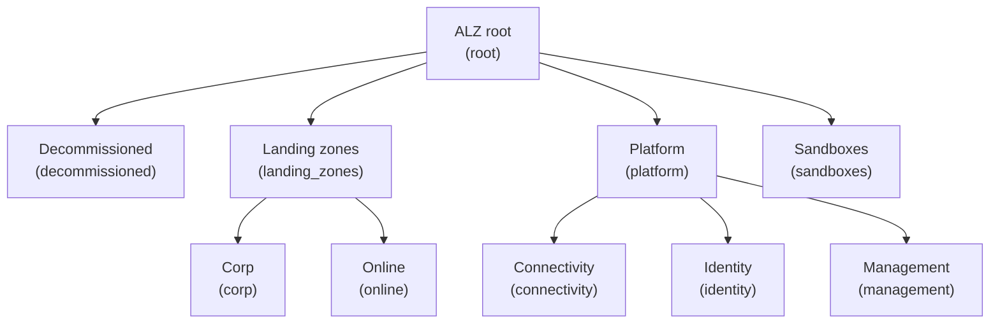
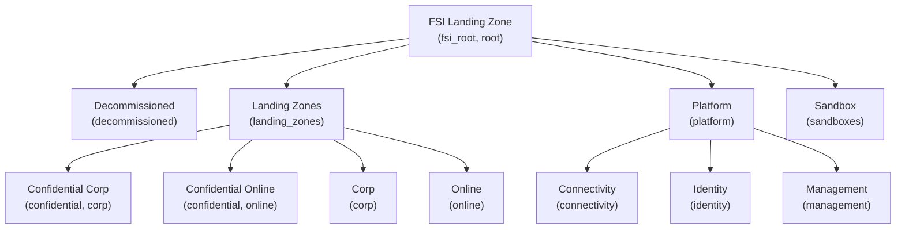

# FSI (Financial Services Industry)
  
This library provides the reference set of Financial Services Industry (FSI) policies, archetypes, and management group architecture.
  
## Dependencies
  
- platform/alz@2024.07.4
  
## Usage
  
```terraform
provider "alz" {
  library_references = [
    {
      path = "platform/fsi"
      tag  = "0000.00.0" # Replace with the desired version
    }
  ]
}
```
  
## Architectures
  
The following architectures are available in this library, please note that the diagrams denote the management group display name and, in brackets, the associated archetypes:
  
### architecture `alz`
  
> [!NOTE]  
> This hierarchy will be deployed as a child of the user-supplied root management group.
  

  
### architecture `fsi`
  
> [!NOTE]  
> This hierarchy will be deployed as a child of the user-supplied root management group.
  

  
## Archetypes
  
### archetype `confidential`
  
#### confidential policy assignments
  
<details><summary>1 policy assignments</summary>

- Enforce-Fsi-Conf
</details>
  
### archetype `connectivity`
  
#### connectivity policy assignments
  
<details><summary>1 policy assignments</summary>

- Enable-DDoS-VNET
</details>
  
### archetype `corp`
  
#### corp policy assignments
  
<details><summary>5 policy assignments</summary>

- Audit-PeDnsZones
- Deny-HybridNetworking
- Deny-Public-Endpoints
- Deny-Public-IP-On-NIC
- Deploy-Private-DNS-Zones
</details>
  
### archetype `decommissioned`
  
#### decommissioned policy assignments
  
<details><summary>1 policy assignments</summary>

- Enforce-ALZ-Decomm
</details>
  
### archetype `fsi_root`
  
#### fsi_root policy set definitions
  
<details><summary>2 policy set definitions</summary>

- 50e4abe0-fc74-4546-9bd4-070ad748670b
- d22ea5a9-2a46-4f25-8d11-e8ef42769e46
</details>
  
### archetype `identity`
  
#### identity policy assignments
  
<details><summary>4 policy assignments</summary>

- Deny-MgmtPorts-Internet
- Deny-Public-IP
- Deny-Subnet-Without-Nsg
- Deploy-VM-Backup
</details>
  
### archetype `landing_zones`
  
#### landing_zones policy assignments
  
<details><summary>25 policy assignments</summary>

- Audit-AppGW-WAF
- Deny-IP-forwarding
- Deny-MgmtPorts-Internet
- Deny-Priv-Esc-AKS
- Deny-Privileged-AKS
- Deny-Storage-http
- Deny-Subnet-Without-Nsg
- Deploy-AKS-Policy
- Deploy-AzSqlDb-Auditing
- Deploy-MDFC-DefSQL-AMA
- Deploy-SQL-TDE
- Deploy-SQL-Threat
- Deploy-VM-Backup
- Deploy-VM-ChangeTrack
- Deploy-VM-Monitoring
- Deploy-VMSS-ChangeTrack
- Deploy-VMSS-Monitoring
- Deploy-vmArc-ChangeTrack
- Deploy-vmHybr-Monitoring
- Enable-AUM-CheckUpdates
- Enable-DDoS-VNET
- Enforce-AKS-HTTPS
- Enforce-ASR
- Enforce-GR-KeyVault
- Enforce-TLS-SSL-H224
</details>
  
### archetype `management`
  
#### management policy assignments
  
<details><summary>1 policy assignments</summary>

- Deploy-Log-Analytics
</details>
  
### archetype `platform`
  
#### platform policy assignments
  
<details><summary>11 policy assignments</summary>

- DenyAction-DeleteUAMIAMA
- Deploy-MDFC-DefSQL-AMA
- Deploy-VM-ChangeTrack
- Deploy-VM-Monitoring
- Deploy-VMSS-ChangeTrack
- Deploy-VMSS-Monitoring
- Deploy-vmArc-ChangeTrack
- Deploy-vmHybr-Monitoring
- Enable-AUM-CheckUpdates
- Enforce-ASR
- Enforce-GR-KeyVault
</details>
  
### archetype `re_01_zonal_residency`
  
#### re_01_zonal_residency policy assignments
  
<details><summary>1 policy assignments</summary>

- RE-01-Zonal-Residency
</details>
  
### archetype `root`
  
#### root policy definitions
  
<details><summary>158 policy definitions</summary>

- Append-AppService-httpsonly
- Append-AppService-latestTLS
- Append-KV-SoftDelete
- Append-Redis-disableNonSslPort
- Append-Redis-sslEnforcement
- Audit-AzureHybridBenefit
- Audit-Disks-UnusedResourcesCostOptimization
- Audit-MachineLearning-PrivateEndpointId
- Audit-PrivateLinkDnsZones
- Audit-PublicIpAddresses-UnusedResourcesCostOptimization
- Audit-ServerFarms-UnusedResourcesCostOptimization
- Deny-AA-child-resources
- Deny-APIM-TLS
- Deny-AppGW-Without-WAF
- Deny-AppGw-Without-Tls
- Deny-AppService-without-BYOC
- Deny-AppServiceApiApp-http
- Deny-AppServiceFunctionApp-http
- Deny-AppServiceWebApp-http
- Deny-AzFw-Without-Policy
- Deny-CognitiveServices-NetworkAcls
- Deny-CognitiveServices-Resource-Kinds
- Deny-CognitiveServices-RestrictOutboundNetworkAccess
- Deny-Databricks-NoPublicIp
- Deny-Databricks-Sku
- Deny-Databricks-VirtualNetwork
- Deny-EH-Premium-CMK
- Deny-EH-minTLS
- Deny-FileServices-InsecureAuth
- Deny-FileServices-InsecureKerberos
- Deny-FileServices-InsecureSmbChannel
- Deny-FileServices-InsecureSmbVersions
- Deny-LogicApp-Public-Network
- Deny-LogicApps-Without-Https
- Deny-MachineLearning-Aks
- Deny-MachineLearning-Compute-SubnetId
- Deny-MachineLearning-Compute-VmSize
- Deny-MachineLearning-ComputeCluster-RemoteLoginPortPublicAccess
- Deny-MachineLearning-ComputeCluster-Scale
- Deny-MachineLearning-HbiWorkspace
- Deny-MachineLearning-PublicAccessWhenBehindVnet
- Deny-MachineLearning-PublicNetworkAccess
- Deny-MgmtPorts-From-Internet
- Deny-MySql-http
- Deny-PostgreSql-http
- Deny-Private-DNS-Zones
- Deny-PublicEndpoint-MariaDB
- Deny-PublicIP
- Deny-RDP-From-Internet
- Deny-Redis-http
- Deny-Service-Endpoints
- Deny-Sql-minTLS
- Deny-SqlMi-minTLS
- Deny-Storage-ContainerDeleteRetentionPolicy
- Deny-Storage-CopyScope
- Deny-Storage-CorsRules
- Deny-Storage-LocalUser
- Deny-Storage-NetworkAclsBypass
- Deny-Storage-NetworkAclsVirtualNetworkRules
- Deny-Storage-ResourceAccessRulesResourceId
- Deny-Storage-ResourceAccessRulesTenantId
- Deny-Storage-SFTP
- Deny-Storage-ServicesEncryption
- Deny-Storage-minTLS
- Deny-StorageAccount-CustomDomain
- Deny-Subnet-Without-Nsg
- Deny-Subnet-Without-Penp
- Deny-Subnet-Without-Udr
- Deny-UDR-With-Specific-NextHop
- Deny-VNET-Peer-Cross-Sub
- Deny-VNET-Peering-To-Non-Approved-VNETs
- Deny-VNet-Peering
- DenyAction-ActivityLogs
- DenyAction-DeleteResources
- DenyAction-DiagnosticLogs
- Deploy-ASC-SecurityContacts
- Deploy-Budget
- Deploy-Custom-Route-Table
- Deploy-DDoSProtection
- Deploy-Diagnostics-AA
- Deploy-Diagnostics-ACI
- Deploy-Diagnostics-ACR
- Deploy-Diagnostics-APIMgmt
- Deploy-Diagnostics-AVDScalingPlans
- Deploy-Diagnostics-AnalysisService
- Deploy-Diagnostics-ApiForFHIR
- Deploy-Diagnostics-ApplicationGateway
- Deploy-Diagnostics-Bastion
- Deploy-Diagnostics-CDNEndpoints
- Deploy-Diagnostics-CognitiveServices
- Deploy-Diagnostics-CosmosDB
- Deploy-Diagnostics-DLAnalytics
- Deploy-Diagnostics-DataExplorerCluster
- Deploy-Diagnostics-DataFactory
- Deploy-Diagnostics-Databricks
- Deploy-Diagnostics-EventGridSub
- Deploy-Diagnostics-EventGridSystemTopic
- Deploy-Diagnostics-EventGridTopic
- Deploy-Diagnostics-ExpressRoute
- Deploy-Diagnostics-Firewall
- Deploy-Diagnostics-FrontDoor
- Deploy-Diagnostics-Function
- Deploy-Diagnostics-HDInsight
- Deploy-Diagnostics-LoadBalancer
- Deploy-Diagnostics-LogAnalytics
- Deploy-Diagnostics-LogicAppsISE
- Deploy-Diagnostics-MariaDB
- Deploy-Diagnostics-MediaService
- Deploy-Diagnostics-MlWorkspace
- Deploy-Diagnostics-MySQL
- Deploy-Diagnostics-NIC
- Deploy-Diagnostics-NetworkSecurityGroups
- Deploy-Diagnostics-PostgreSQL
- Deploy-Diagnostics-PowerBIEmbedded
- Deploy-Diagnostics-RedisCache
- Deploy-Diagnostics-Relay
- Deploy-Diagnostics-SQLElasticPools
- Deploy-Diagnostics-SQLMI
- Deploy-Diagnostics-SignalR
- Deploy-Diagnostics-TimeSeriesInsights
- Deploy-Diagnostics-TrafficManager
- Deploy-Diagnostics-VM
- Deploy-Diagnostics-VMSS
- Deploy-Diagnostics-VNetGW
- Deploy-Diagnostics-VWanS2SVPNGW
- Deploy-Diagnostics-VirtualNetwork
- Deploy-Diagnostics-WVDAppGroup
- Deploy-Diagnostics-WVDHostPools
- Deploy-Diagnostics-WVDWorkspace
- Deploy-Diagnostics-WebServerFarm
- Deploy-Diagnostics-Website
- Deploy-Diagnostics-iotHub
- Deploy-FirewallPolicy
- Deploy-LogicApp-TLS
- Deploy-MDFC-Arc-SQL-DCR-Association
- Deploy-MDFC-Arc-Sql-DefenderSQL-DCR
- Deploy-MDFC-SQL-AMA
- Deploy-MDFC-SQL-DefenderSQL
- Deploy-MDFC-SQL-DefenderSQL-DCR
- Deploy-MySQL-sslEnforcement
- Deploy-Nsg-FlowLogs
- Deploy-Nsg-FlowLogs-to-LA
- Deploy-PostgreSQL-sslEnforcement
- Deploy-Private-DNS-Generic
- Deploy-SQL-minTLS
- Deploy-Sql-AuditingSettings
- Deploy-Sql-SecurityAlertPolicies
- Deploy-Sql-Tde
- Deploy-Sql-vulnerabilityAssessments
- Deploy-Sql-vulnerabilityAssessments_20230706
- Deploy-SqlMi-minTLS
- Deploy-Storage-sslEnforcement
- Deploy-UserAssignedManagedIdentity-VMInsights
- Deploy-VNET-HubSpoke
- Deploy-Vm-autoShutdown
- Deploy-Windows-DomainJoin
- Modify-NSG
- Modify-UDR
</details>
  
#### root policy set definitions
  
<details><summary>45 policy set definitions</summary>

- Audit-TrustedLaunch
- Audit-UnusedResourcesCostOptimization
- Deny-PublicPaaSEndpoints
- DenyAction-DeleteProtection
- Deploy-AUM-CheckUpdates
- Deploy-Diagnostics-LogAnalytics
- Deploy-MDFC-Config
- Deploy-MDFC-Config_20240319
- Deploy-MDFC-DefenderSQL-AMA
- Deploy-Private-DNS-Zones
- Deploy-Sql-Security
- Deploy-Sql-Security_20240529
- Enforce-ACSB
- Enforce-ALZ-Decomm
- Enforce-ALZ-Sandbox
- Enforce-Backup
- Enforce-EncryptTransit
- Enforce-EncryptTransit_20240509
- Enforce-Encryption-CMK
- Enforce-Guardrails-APIM
- Enforce-Guardrails-AppServices
- Enforce-Guardrails-Automation
- Enforce-Guardrails-CognitiveServices
- Enforce-Guardrails-Compute
- Enforce-Guardrails-ContainerApps
- Enforce-Guardrails-ContainerInstance
- Enforce-Guardrails-ContainerRegistry
- Enforce-Guardrails-CosmosDb
- Enforce-Guardrails-DataExplorer
- Enforce-Guardrails-DataFactory
- Enforce-Guardrails-EventGrid
- Enforce-Guardrails-EventHub
- Enforce-Guardrails-KeyVault
- Enforce-Guardrails-KeyVault-Sup
- Enforce-Guardrails-Kubernetes
- Enforce-Guardrails-MachineLearning
- Enforce-Guardrails-MySQL
- Enforce-Guardrails-Network
- Enforce-Guardrails-OpenAI
- Enforce-Guardrails-PostgreSQL
- Enforce-Guardrails-SQL
- Enforce-Guardrails-ServiceBus
- Enforce-Guardrails-Storage
- Enforce-Guardrails-Synapse
- Enforce-Guardrails-VirtualDesktop
</details>
  
#### root policy assignments
  
<details><summary>15 policy assignments</summary>

- Audit-ResourceRGLocation
- Audit-TrustedLaunch
- Audit-UnusedResources
- Audit-ZoneResiliency
- Deny-Classic-Resources
- Deny-UnmanagedDisk
- Deploy-ASC-Monitoring
- Deploy-AzActivity-Log
- Deploy-Diag-Logs
- Deploy-MDEndpoints
- Deploy-MDEndpointsAMA
- Deploy-MDFC-Config-H224
- Deploy-MDFC-OssDb
- Deploy-MDFC-SqlAtp
- Enforce-ACSB
</details>
  
#### root role definitions
  
<details><summary>5 role definitions</summary>

- Application-Owners
- Network-Management
- Network-Subnet-Contributor
- Security-Operations
- Subscription-Owner
</details>
  
### archetype `sandboxes`
  
#### sandboxes policy assignments
  
<details><summary>1 policy assignments</summary>

- Enforce-ALZ-Sandbox
</details>
  
### archetype `so_01_data_residency`
  
#### so_01_data_residency policy assignments
  
<details><summary>1 policy assignments</summary>

- SO-01-Data-Residency
</details>
  
### archetype `so_04_cmk`
  
#### so_04_cmk policy assignments
  
<details><summary>1 policy assignments</summary>

- SO-04-CMK
</details>
  
### archetype `tr_01_logging`
  
#### tr_01_logging policy assignments
  
<details><summary>1 policy assignments</summary>

- TR-01-Logging
</details>
  
## Policy Default Values
  
The following policy default values are available in this library:
  
### default name `allowedLocations`
  
#### assignment `SO-01-Data-Residency`
  
<details><summary>1 parameter names</summary>

- listOfAllowedLocations-1
</details>
  
### default name `allowedLocationsForConfidentialComputing`
  
#### assignment `Enforce-Fsi-Conf`
  
<details><summary>1 parameter names</summary>

- listOfAllowedLocations
</details>
  
### default name `ddosProtectionPlanEffect`
  
#### assignment `Enable-DDoS-VNET`
  
<details><summary>1 parameter names</summary>

- effect
</details>
  
### default name `ddosProtectionPlanId`
  
#### assignment `Enable-DDoS-VNET`
  
<details><summary>1 parameter names</summary>

- ddosPlan
</details>
  
### default name `emailSecurityContact`
  
#### assignment `Deploy-MDFC-Config-H224`
  
<details><summary>1 parameter names</summary>

- emailSecurityContact
</details>
  
### default name `logAnalyticsWorkspaceId`
  
#### assignment `Deploy-Diag-Logs`
  
<details><summary>1 parameter names</summary>

- logAnalytics
</details>
  
#### assignment `TR-01-Logging`
  
<details><summary>1 parameter names</summary>

- logAnalytics
</details>
  
### default name `policyEffect`
  
#### assignment `Enforce-Fsi-Conf`
  
<details><summary>1 parameter names</summary>

- effect
</details>
  
---
## Contents
  
### all policy definitions
  
<details><summary>158 policy definitions</summary>

- Append-AppService-httpsonly
- Append-AppService-latestTLS
- Append-KV-SoftDelete
- Append-Redis-disableNonSslPort
- Append-Redis-sslEnforcement
- Audit-AzureHybridBenefit
- Audit-Disks-UnusedResourcesCostOptimization
- Audit-MachineLearning-PrivateEndpointId
- Audit-PrivateLinkDnsZones
- Audit-PublicIpAddresses-UnusedResourcesCostOptimization
- Audit-ServerFarms-UnusedResourcesCostOptimization
- Deny-AA-child-resources
- Deny-APIM-TLS
- Deny-AppGW-Without-WAF
- Deny-AppGw-Without-Tls
- Deny-AppService-without-BYOC
- Deny-AppServiceApiApp-http
- Deny-AppServiceFunctionApp-http
- Deny-AppServiceWebApp-http
- Deny-AzFw-Without-Policy
- Deny-CognitiveServices-NetworkAcls
- Deny-CognitiveServices-Resource-Kinds
- Deny-CognitiveServices-RestrictOutboundNetworkAccess
- Deny-Databricks-NoPublicIp
- Deny-Databricks-Sku
- Deny-Databricks-VirtualNetwork
- Deny-EH-Premium-CMK
- Deny-EH-minTLS
- Deny-FileServices-InsecureAuth
- Deny-FileServices-InsecureKerberos
- Deny-FileServices-InsecureSmbChannel
- Deny-FileServices-InsecureSmbVersions
- Deny-LogicApp-Public-Network
- Deny-LogicApps-Without-Https
- Deny-MachineLearning-Aks
- Deny-MachineLearning-Compute-SubnetId
- Deny-MachineLearning-Compute-VmSize
- Deny-MachineLearning-ComputeCluster-RemoteLoginPortPublicAccess
- Deny-MachineLearning-ComputeCluster-Scale
- Deny-MachineLearning-HbiWorkspace
- Deny-MachineLearning-PublicAccessWhenBehindVnet
- Deny-MachineLearning-PublicNetworkAccess
- Deny-MgmtPorts-From-Internet
- Deny-MySql-http
- Deny-PostgreSql-http
- Deny-Private-DNS-Zones
- Deny-PublicEndpoint-MariaDB
- Deny-PublicIP
- Deny-RDP-From-Internet
- Deny-Redis-http
- Deny-Service-Endpoints
- Deny-Sql-minTLS
- Deny-SqlMi-minTLS
- Deny-Storage-ContainerDeleteRetentionPolicy
- Deny-Storage-CopyScope
- Deny-Storage-CorsRules
- Deny-Storage-LocalUser
- Deny-Storage-NetworkAclsBypass
- Deny-Storage-NetworkAclsVirtualNetworkRules
- Deny-Storage-ResourceAccessRulesResourceId
- Deny-Storage-ResourceAccessRulesTenantId
- Deny-Storage-SFTP
- Deny-Storage-ServicesEncryption
- Deny-Storage-minTLS
- Deny-StorageAccount-CustomDomain
- Deny-Subnet-Without-Nsg
- Deny-Subnet-Without-Penp
- Deny-Subnet-Without-Udr
- Deny-UDR-With-Specific-NextHop
- Deny-VNET-Peer-Cross-Sub
- Deny-VNET-Peering-To-Non-Approved-VNETs
- Deny-VNet-Peering
- DenyAction-ActivityLogs
- DenyAction-DeleteResources
- DenyAction-DiagnosticLogs
- Deploy-ASC-SecurityContacts
- Deploy-Budget
- Deploy-Custom-Route-Table
- Deploy-DDoSProtection
- Deploy-Diagnostics-AA
- Deploy-Diagnostics-ACI
- Deploy-Diagnostics-ACR
- Deploy-Diagnostics-APIMgmt
- Deploy-Diagnostics-AVDScalingPlans
- Deploy-Diagnostics-AnalysisService
- Deploy-Diagnostics-ApiForFHIR
- Deploy-Diagnostics-ApplicationGateway
- Deploy-Diagnostics-Bastion
- Deploy-Diagnostics-CDNEndpoints
- Deploy-Diagnostics-CognitiveServices
- Deploy-Diagnostics-CosmosDB
- Deploy-Diagnostics-DLAnalytics
- Deploy-Diagnostics-DataExplorerCluster
- Deploy-Diagnostics-DataFactory
- Deploy-Diagnostics-Databricks
- Deploy-Diagnostics-EventGridSub
- Deploy-Diagnostics-EventGridSystemTopic
- Deploy-Diagnostics-EventGridTopic
- Deploy-Diagnostics-ExpressRoute
- Deploy-Diagnostics-Firewall
- Deploy-Diagnostics-FrontDoor
- Deploy-Diagnostics-Function
- Deploy-Diagnostics-HDInsight
- Deploy-Diagnostics-LoadBalancer
- Deploy-Diagnostics-LogAnalytics
- Deploy-Diagnostics-LogicAppsISE
- Deploy-Diagnostics-MariaDB
- Deploy-Diagnostics-MediaService
- Deploy-Diagnostics-MlWorkspace
- Deploy-Diagnostics-MySQL
- Deploy-Diagnostics-NIC
- Deploy-Diagnostics-NetworkSecurityGroups
- Deploy-Diagnostics-PostgreSQL
- Deploy-Diagnostics-PowerBIEmbedded
- Deploy-Diagnostics-RedisCache
- Deploy-Diagnostics-Relay
- Deploy-Diagnostics-SQLElasticPools
- Deploy-Diagnostics-SQLMI
- Deploy-Diagnostics-SignalR
- Deploy-Diagnostics-TimeSeriesInsights
- Deploy-Diagnostics-TrafficManager
- Deploy-Diagnostics-VM
- Deploy-Diagnostics-VMSS
- Deploy-Diagnostics-VNetGW
- Deploy-Diagnostics-VWanS2SVPNGW
- Deploy-Diagnostics-VirtualNetwork
- Deploy-Diagnostics-WVDAppGroup
- Deploy-Diagnostics-WVDHostPools
- Deploy-Diagnostics-WVDWorkspace
- Deploy-Diagnostics-WebServerFarm
- Deploy-Diagnostics-Website
- Deploy-Diagnostics-iotHub
- Deploy-FirewallPolicy
- Deploy-LogicApp-TLS
- Deploy-MDFC-Arc-SQL-DCR-Association
- Deploy-MDFC-Arc-Sql-DefenderSQL-DCR
- Deploy-MDFC-SQL-AMA
- Deploy-MDFC-SQL-DefenderSQL
- Deploy-MDFC-SQL-DefenderSQL-DCR
- Deploy-MySQL-sslEnforcement
- Deploy-Nsg-FlowLogs
- Deploy-Nsg-FlowLogs-to-LA
- Deploy-PostgreSQL-sslEnforcement
- Deploy-Private-DNS-Generic
- Deploy-SQL-minTLS
- Deploy-Sql-AuditingSettings
- Deploy-Sql-SecurityAlertPolicies
- Deploy-Sql-Tde
- Deploy-Sql-vulnerabilityAssessments
- Deploy-Sql-vulnerabilityAssessments_20230706
- Deploy-SqlMi-minTLS
- Deploy-Storage-sslEnforcement
- Deploy-UserAssignedManagedIdentity-VMInsights
- Deploy-VNET-HubSpoke
- Deploy-Vm-autoShutdown
- Deploy-Windows-DomainJoin
- Modify-NSG
- Modify-UDR
</details>
  
### all policy set definitions
  
<details><summary>47 policy set definitions</summary>

- 50e4abe0-fc74-4546-9bd4-070ad748670b
- Audit-TrustedLaunch
- Audit-UnusedResourcesCostOptimization
- Deny-PublicPaaSEndpoints
- DenyAction-DeleteProtection
- Deploy-AUM-CheckUpdates
- Deploy-Diagnostics-LogAnalytics
- Deploy-MDFC-Config
- Deploy-MDFC-Config_20240319
- Deploy-MDFC-DefenderSQL-AMA
- Deploy-Private-DNS-Zones
- Deploy-Sql-Security
- Deploy-Sql-Security_20240529
- Enforce-ACSB
- Enforce-ALZ-Decomm
- Enforce-ALZ-Sandbox
- Enforce-Backup
- Enforce-EncryptTransit
- Enforce-EncryptTransit_20240509
- Enforce-Encryption-CMK
- Enforce-Guardrails-APIM
- Enforce-Guardrails-AppServices
- Enforce-Guardrails-Automation
- Enforce-Guardrails-CognitiveServices
- Enforce-Guardrails-Compute
- Enforce-Guardrails-ContainerApps
- Enforce-Guardrails-ContainerInstance
- Enforce-Guardrails-ContainerRegistry
- Enforce-Guardrails-CosmosDb
- Enforce-Guardrails-DataExplorer
- Enforce-Guardrails-DataFactory
- Enforce-Guardrails-EventGrid
- Enforce-Guardrails-EventHub
- Enforce-Guardrails-KeyVault
- Enforce-Guardrails-KeyVault-Sup
- Enforce-Guardrails-Kubernetes
- Enforce-Guardrails-MachineLearning
- Enforce-Guardrails-MySQL
- Enforce-Guardrails-Network
- Enforce-Guardrails-OpenAI
- Enforce-Guardrails-PostgreSQL
- Enforce-Guardrails-SQL
- Enforce-Guardrails-ServiceBus
- Enforce-Guardrails-Storage
- Enforce-Guardrails-Synapse
- Enforce-Guardrails-VirtualDesktop
- d22ea5a9-2a46-4f25-8d11-e8ef42769e46
</details>
  
### all policy assignments
  
<details><summary>74 policy assignments</summary>

- Audit-AppGW-WAF
- Audit-PeDnsZones
- Audit-ResourceRGLocation
- Audit-TrustedLaunch
- Audit-UnusedResources
- Audit-ZoneResiliency
- Deny-AppGW-Without-WAF
- Deny-Classic-Resources
- Deny-DataB-Pip
- Deny-DataB-Sku
- Deny-DataB-Vnet
- Deny-HybridNetworking
- Deny-IP-forwarding
- Deny-MgmtPorts-Internet
- Deny-Priv-Esc-AKS
- Deny-Private-DNS-Zones
- Deny-Privileged-AKS
- Deny-Public-Endpoints
- Deny-Public-IP
- Deny-Public-IP-On-NIC
- Deny-RDP-From-Internet
- Deny-RSG-Locations
- Deny-Resource-Locations
- Deny-Resource-Types
- Deny-Storage-http
- Deny-Subnet-Without-Nsg
- Deny-Subnet-Without-Udr
- Deny-UnmanagedDisk
- DenyAction-DeleteUAMIAMA
- Deploy-AKS-Policy
- Deploy-ASC-Monitoring
- Deploy-AzActivity-Log
- Deploy-AzSqlDb-Auditing
- Deploy-Diag-Logs
- Deploy-Log-Analytics
- Deploy-MDEndpoints
- Deploy-MDEndpointsAMA
- Deploy-MDFC-Config
- Deploy-MDFC-Config-H224
- Deploy-MDFC-DefSQL-AMA
- Deploy-MDFC-DefenSQL-AMA
- Deploy-MDFC-OssDb
- Deploy-MDFC-SqlAtp
- Deploy-Private-DNS-Zones
- Deploy-Resource-Diag
- Deploy-SQL-DB-Auditing
- Deploy-SQL-Security
- Deploy-SQL-TDE
- Deploy-SQL-Threat
- Deploy-UAMI-VMInsights
- Deploy-VM-Backup
- Deploy-VM-ChangeTrack
- Deploy-VM-Monitoring
- Deploy-VMSS-ChangeTrack
- Deploy-VMSS-Monitoring
- Deploy-vmArc-ChangeTrack
- Deploy-vmHybr-Monitoring
- Enable-AUM-CheckUpdates
- Enable-AUM-VM-Windows
- Enable-AUM-VMHyb-Windows
- Enable-DDoS-VNET
- Enforce-ACSB
- Enforce-AKS-HTTPS
- Enforce-ALZ-Decomm
- Enforce-ALZ-Sandbox
- Enforce-ASR
- Enforce-Fsi-Conf
- Enforce-GR-KeyVault
- Enforce-TLS-SSL
- Enforce-TLS-SSL-H224
- RE-01-Zonal-Residency
- SO-01-Data-Residency
- SO-04-CMK
- TR-01-Logging
</details>
  
### all role definitions
  
<details><summary>5 role definitions</summary>

- Application-Owners
- Network-Management
- Network-Subnet-Contributor
- Security-Operations
- Subscription-Owner
</details>
  