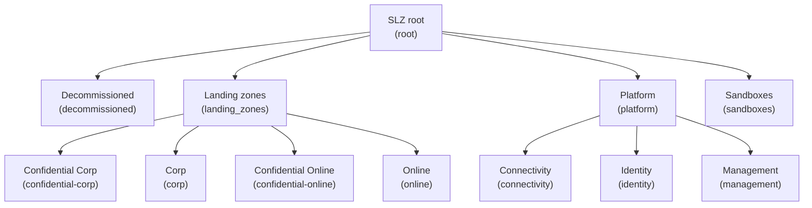

# SLZ (Azure Landing Zones)
  
This library provides the reference set of Sovereign Landing Zones (SLZ) policies, archetypes, and management group architecture.
  
## Usage
  
```terraform
provider "slz" {
  library_references = [
    {
      path = "platform/slz"
      tag  = "0000.00.0" # Replace with the desired version
    }
  ]
}
```
  
## Architectures
  
The following architectures are available in this library, please note that the diagrams denote the management group display name and, in brackets, the associated archetypes:
  
### architecture `slz`
  
> [!NOTE]  
> This hierarchy will be deployed as a child of the user-supplied root management group.
  

  
## Archetypes
  
### archetype `confidential`
  
#### confidential policy assignments
  
<details><summary>1 policy assignments</summary>

- Enforce-Sovereign-Conf
</details>

### archetype `global`
  
#### global policy assignments
  
<details><summary>1 policy assignments</summary>

- Enforce-Sovereign-Global
</details>  

## Policy Default Values
  
The following policy default values are available in this library:

### default name `allowedLocationsForConfidentialComputing`

#### assignment `Enforce-Sovereign-Conf`
  
<details><summary>1 parameter names</summary>

- listOfAllowedLocations
</details>

### default name `listOfAllowedLocations`

#### assignment `Enforce-Sovereign-Global`
  
<details><summary>1 parameter names</summary>

- listOfAllowedLocations
</details>

### default name `policyEffect`

#### assignment `Enforce-Sovereign-Conf`
  
<details><summary>1 parameter names</summary>

- effect
</details>

#### assignment `Enforce-Sovereign-Global`
  
<details><summary>1 parameter names</summary>

- effect
</details>

> [!NOTE]  
> Set the apply_alz_archetypes_via_architecture_definition_template parameter to true in the inputs.yaml file to apply ALZ archetypes to your landing zones. For more details, visit the [Azure Landing Zones Library](https://github.com/Azure/Azure-Landing-Zones-Library/tree/main/platform/alz).